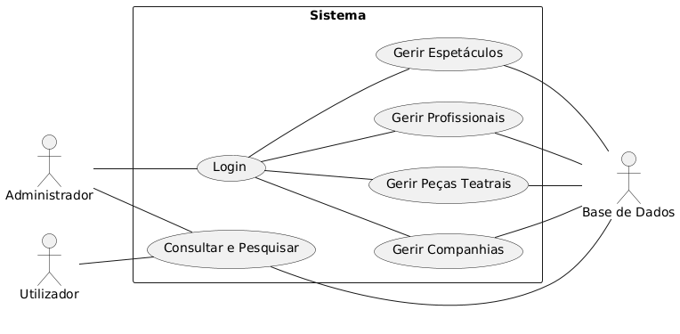
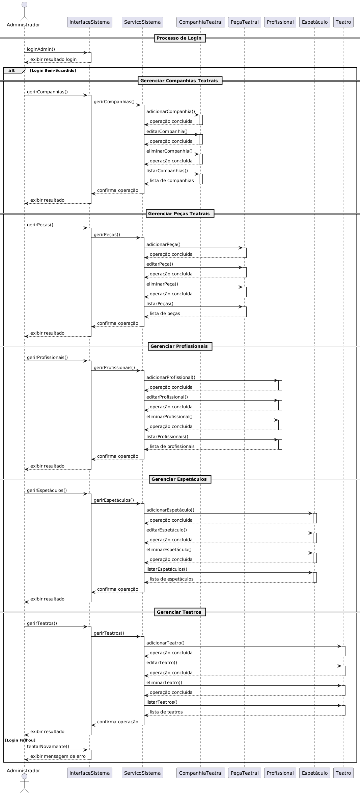
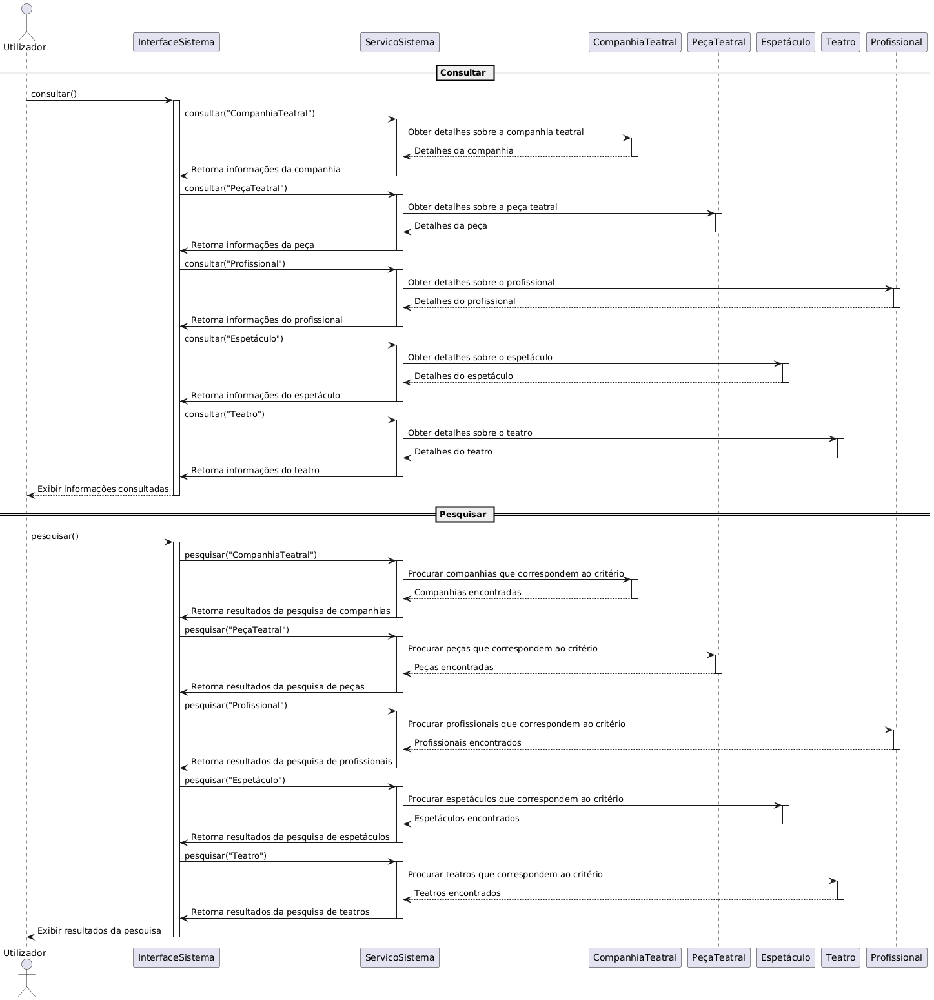
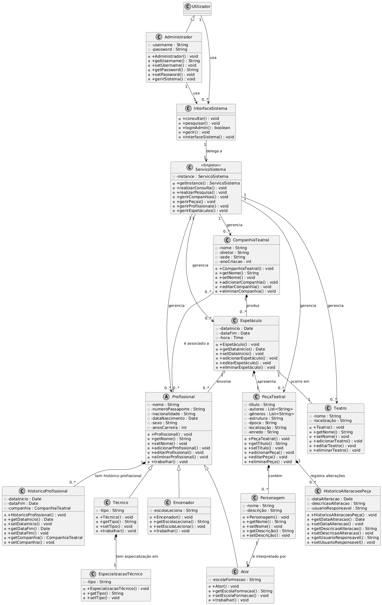

# UML Diagrams Overview

Este documento apresenta os diagramas UML que detalham os diferentes aspectos do sistema.

## Diagramas Disponíveis

### Diagramas de Casos de Uso

**Descrição:** Representa as interações principais entre os utilizadores (Administrador e Utilizador) e o sistema.

### Diagramas de Sequência

**Descrição:** Mostra o fluxo de operações realizadas pelo Administrador.

**Descrição:** Mostra o fluxo de operações realizadas pelo Utilizador.

### Diagrama de Classes

**Descrição:** Representa a estrutura estática do sistema, incluindo classes, atributos, métodos e relacionamentos.
